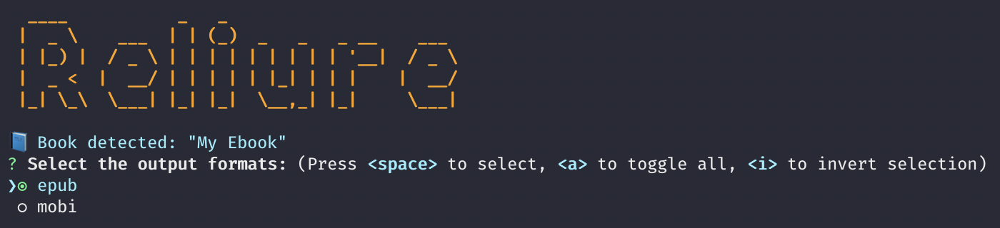

# Reliure

[](https://github.com/GreatWizard/reliure/blob/master/LICENSE.md)
[](https://liberapay.com/GreatWizard/)
[](https://beerpay.io/GreatWizard/reliure)

Bind your LaTeX books for e-readers.

This terminal tool is able to generate epub or mobi files.



## Installation

You need to have on your computer:

- Node.js: https://nodejs.org/en/download/
- Pandoc: https://pandoc.org/installing.html

Then, you can install the Reliure tool globally in order to be able to execute it wherever you want:

```shell
npm install -g reliure@latest
```

## Usage

### Configuration file

Your entry point is a configuration file named `reliure.yml`:

```yaml
# Name of the output file
filename: "My Ebook"

# Default configuration applied to every format
default:
  # Cover image of the ebook
  coverImage: "cover.jpg"
  # Files used to build the ebook (works with only one file currently)
  files:
    - "my-ebook.tex"

  # Metadata following pandoc's options https://pandoc.org/MANUAL.html#epub-metadata
  metadata:
    language: "fr-FR"
    lang: "fr"

# Overridden configuration for epub format
epub:
  metadata:
    identifier: "urn:isbn:1234567890123"
    rights: "ISBN: 123-4-5678901-2-3"

# Overridden configuration for mobi format
mobi:
  coverImage: "cover-mobi.jpg"
  metadata:
    identifier: "urn:isbn:1234567890145"
    rights: "ISBN: 123-4-5678901-4-5"
```

### Commands

Usage: `reliure [options]`

#### Options:

- `--epub`: specify to bound the epub format
- `--mobi`: specify to bound the mobi format
- `-v`, `--version`: print the version number
- `-h`, `--help`: print usage information

#### Examples:

```shell
reliure --epub --mobi
reliure -v
reliure --version
```
