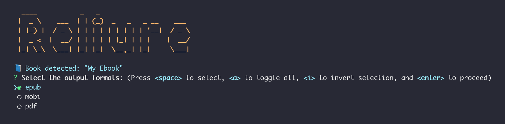

# Reliure

[](https://github.com/GreatWizard/reliure/actions?query=workflow%3Atest)
[](https://github.com/GreatWizard/reliure/blob/master/LICENSE.md)
[](https://liberapay.com/GreatWizard/)

Bind your LaTeX and Markdown books for e-readers.



## Features

- Compiles LaTeX and Markdown files in epub, mobi and pdf
- Cross-platform compatibility (Windows, Mac and Linux)
- Configuration in a single file
- Replaces part of the configuration for a specific format
- Supports cover image
### Features only for ebooks (epub and mobi)

- Supports metadata
- Supports custom CSS
- Supports automatic regexp substitutions

ℹ️ KindleGen does not work on 64-bit MacOS. On this platform, you can only compile in epub.

## Prerequisites

You need to have on your computer:

- Node.js: https://nodejs.org/en/download/
- Pandoc: https://pandoc.org/installing.html

## Installation

Then, you can install the Reliure tool globally in order to be able to execute it wherever you want:

```shell
npm install -g reliure@latest
```

## Usage

### Configuration file

Your entry point is a configuration file named `reliure.yml`:

```yaml
# Name of the output file
filename: My Ebook

# Default configuration applied to every format
default:
  # Cover image of the ebook
  coverImage: cover.jpg
  # Deactivate the default CSS (off by default)
  ignoreDefaultStyleSheet: on/off
  # Custom Style sheets appends to the default stylesheet
  styleSheets:
    - style.css
  # Files used to build the ebook (works with only one file currently)
  files:
    - my-ebook.md

  # Metadata following pandoc's options https://pandoc.org/MANUAL.html#epub-metadata
  metadata:
    lang: fr-FR
  
  # Extra metadata
  extraMetadata:
    "calibre:series": My Collection
    "calibre:series_index": 1

  # Example of substitutions for chapters, cover and title page files
  textSubstitutions:
    - regex: <p>\*{3}</p>
      replacement: <p class="center">***</p>

  # Example of substitutions for navigation file
  navSubstitutions:
    - regex: <!DOCTYPE html>
      replacement: <!DOCTYPE html2>

  # Example of substitutions for the OPF file
  opfSubstitutions:
    - regex: <dc:language>fr-FR</dc:language>
      replacement: <dc:language>fr-BE</dc:language>

# Overridden configuration for epub format
epub:
  metadata:
    identifier: "urn:isbn:1234567890123"
    rights: "ISBN: 123-4-5678901-2-3"

# Overridden configuration for mobi format
mobi:
  coverImage: cover-mobi.jpg
  metadata:
    identifier: "urn:isbn:1234567890145"
    rights: "ISBN: 123-4-5678901-4-5"
```

### Commands

Usage: `reliure [options]`

#### Options:

- `--epub`: specify to bound the epub format
- `--mobi`: specify to bound the mobi format
- `--pdf`: specify to bound the pdf format
- `-v`, `--version`: print the version number
- `-h`, `--help`: print usage information

#### Examples:

```shell
reliure --epub --mobi --pdf
reliure -v
reliure --version
```
